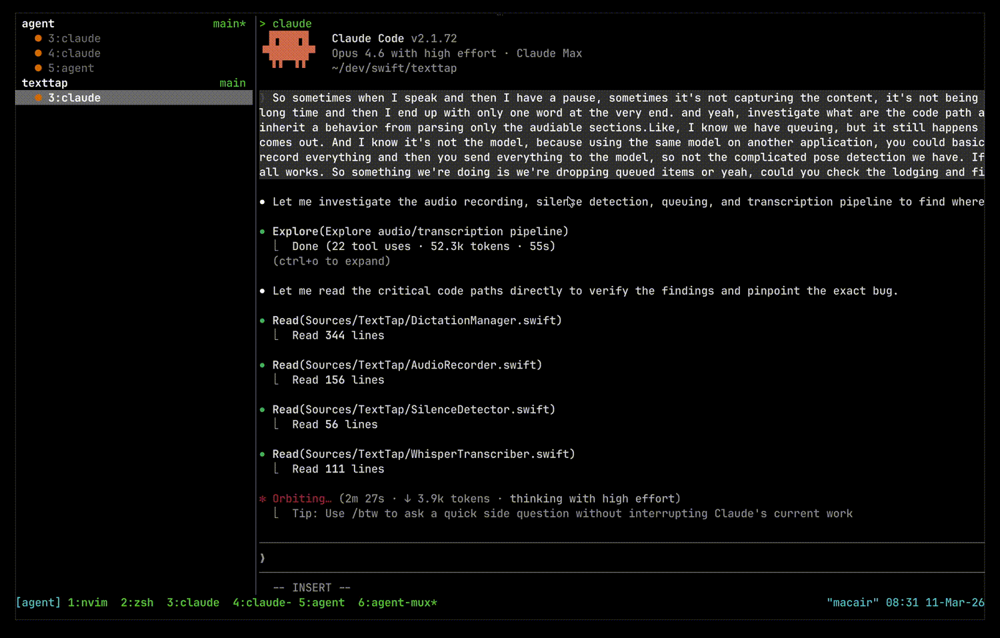

# agent-mux

A TUI for multiplexing AI coding agent sessions in tmux.

Lists all active agent panes (Claude Code, Open Code, Gemini CLI, Codex CLI)
grouped by workspace, with a live preview panel showing each session's output.
Select a session and press enter to jump to it.

<p align="center">
  
</p>

## Requirements

- Rust 1.85+
- tmux (must be run inside a tmux session)

## Setup

### Install

```
cargo install --path .
```

### Run from source

```
cargo run --release
```

Run the watcher directly:

```
cargo run --release -- watch
```

### Configure tmux

Add to your `~/.tmux.conf` to start the background watcher and set up a key
binding:

```tmux
run-shell -b "agent-mux watch"
bind j run-shell "tmux neww agent-mux"
```

The watcher polls session statuses every 500ms, so the TUI opens instantly with
accurate statuses.

Reload tmux: `tmux source-file ~/.tmux.conf`

## Usage

From inside tmux:

```
agent-mux
```

Or use the key binding: `prefix + j`

### Keys

| Key              | Action               |
| ---------------- | -------------------- |
| `j` / `k`        | Navigate up/down     |
| `[count]j` / `k` | Move N sessions      |
| `gg`             | Go to first session  |
| `G`              | Go to last session   |
| `space`          | Toggle attention     |
| `s` / `u`        | Stash/unstash        |
| `enter`          | Switch to session    |
| `dd`             | Kill session         |
| `R`              | Reload watch process |
| `H` / `L`        | Resize sidebar       |
| `?`              | Toggle help          |
| `q` / `esc`      | Quit                 |

The sidebar separator can also be dragged with the mouse.
